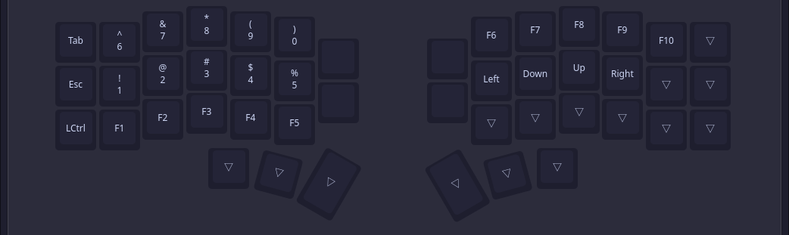
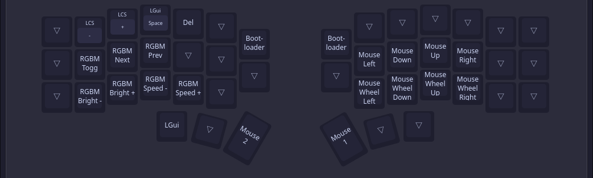

# a simple QMK keymap

_optimised for hyprland and nvim<3_

---
## Key Features

- QWERTY layout
- Dedicated Mouse layer
- Vim like navigation
- Number and navigation on the same layer
> [!IMPORTANT]
> I am still tring to find the perfect balance.

## Layers

### Base Layer

### Layer 1(Numbers and Navigation)

### Layer 3(Symbols)

### Layer 4(Mouse and Extras)

