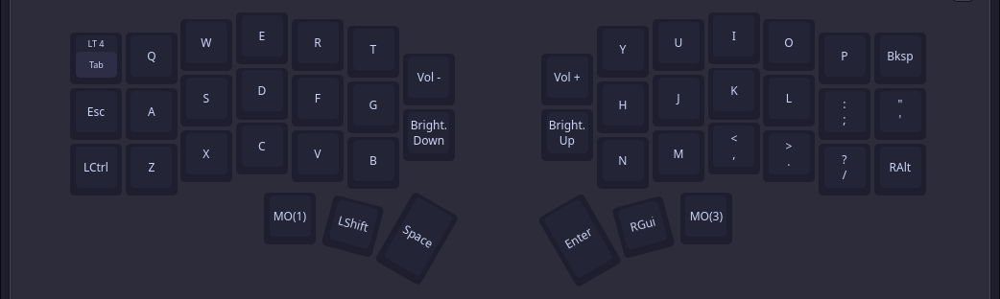
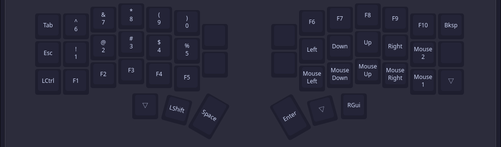
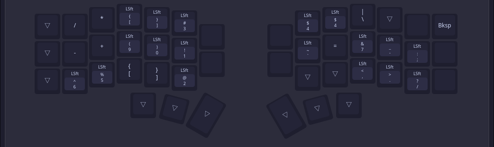

# a simple QMK keymap

_optimised for hyprland and nvim<3_

---
## Key Features

- QWERTY layout
- Mouse on Navigation layer
- Vim like navigation
- Number and navigation on the same layer
- Dedicated hyprland management layer
> [!IMPORTANT]
> This is still work in progress.

## Layers

# Base Layer

# Layer 1(Numbers and Navigation)

# Layer 3(Symbols)

# Layer 4(Mouse and Extras)

